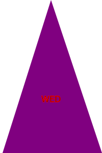

# SVG-Logo-Maker
5.23.23 Object-oriented Programming: A  command-line application that takes in user input to generate a logo and saves it as an SVG file

## Acceptance Criteria

1)WHEN I am prompted for text THEN I can enter up to three characters

2)WHEN I am prompted for the text color THEN I can enter a color keyword (OR a hexadecimal number)

3)WHEN I am prompted for a shape THEN I am presented with a list of shapes to choose from: circle, triangle, and square

4)WHEN I am prompted for the shape's color THEN I can enter a color keyword (OR a hexadecimal number)

5)WHEN I have entered input for all the prompts THEN an SVG file is created named `logo.svg` 
  AND the output text "Generated logo.svg" is printed in the command line

6)WHEN I open the `logo.svg` file in a browser THEN I am shown a 300x200 pixel image that matches the criteria I entered

## Walkthrough Video 
https://drive.google.com/file/d/1oCUuNDRF3yvBWKTeeBAFvI2ehDXYhke3/view?usp=sharing

## Sample SVG file for a project generated using this application

